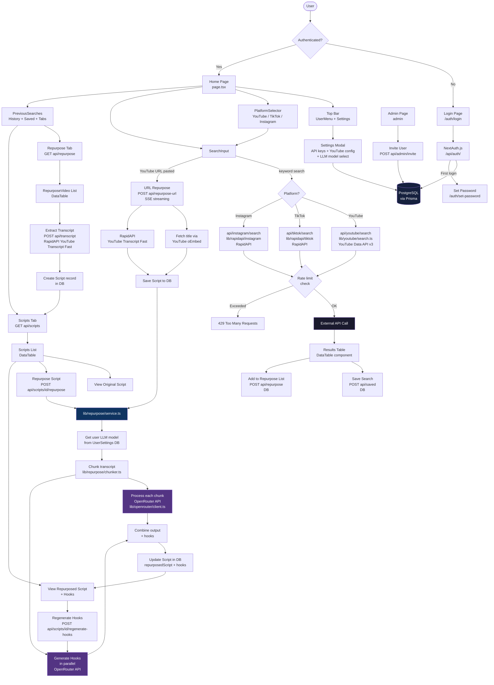

```mermaid
flowchart TD
    User([User]) --> Auth{Authenticated?}
    Auth -- No --> Login["Login Page\n/auth/login"]
    Login --> NextAuth["NextAuth.js\n/api/auth/"]
    NextAuth --> DB[(PostgreSQL\nvia Prisma)]
    NextAuth -- First login --> SetPassword["Set Password\n/auth/set-password"]
    Auth -- Yes --> Home["Home Page\npage.tsx"]

    Home --> TopBar[Top Bar\nUserMenu + Settings]
    Home --> PlatformSelect[PlatformSelector\nYouTube / TikTok / Instagram]
    Home --> SearchInput[SearchInput]
    Home --> PreviousSearches[PreviousSearches\nHistory + Saved + Tabs]

    PlatformSelect --> SearchInput
    SearchInput -- keyword search --> HandleSearch{Platform?}
    SearchInput -- YouTube URL pasted --> URLRepurpose

    HandleSearch -- YouTube --> YT_API["api/youtube/search\nlib/youtube/search.ts\nYouTube Data API v3"]
    HandleSearch -- TikTok --> TK_API["api/tiktok/search\nlib/rapidapi/tiktok\nRapidAPI"]
    HandleSearch -- Instagram --> IG_API["api/instagram/search\nlib/rapidapi/instagram\nRapidAPI"]

    YT_API --> RateLimit{Rate limit\ncheck}
    TK_API --> RateLimit
    IG_API --> RateLimit
    RateLimit -- OK --> ExternalAPI[External API Call]
    RateLimit -- Exceeded --> E429[429 Too Many Requests]
    ExternalAPI --> Results[Results Table\nDataTable component]

    Results --> SaveSearch["Save Search\nPOST api/saved\nDB"]
    Results --> AddRepurpose["Add to Repurpose List\nPOST api/repurpose\nDB"]

    PreviousSearches --> RepurposeTab["Repurpose Tab\nGET api/repurpose"]
    PreviousSearches --> ScriptsTab["Scripts Tab\nGET api/scripts"]

    RepurposeTab --> RepurposeList[RepurposeVideo List\nDataTable]
    RepurposeList --> ExtractTranscript["Extract Transcript\nPOST api/transcript\nRapidAPI YouTube Transcript Fast"]
    ExtractTranscript --> CreateScript[Create Script record\nin DB]
    CreateScript --> ScriptsTab

    ScriptsTab --> ScriptsList[Scripts List\nDataTable]
    ScriptsList --> ViewOriginal[View Original Script]
    ScriptsList --> RepurposeScript["Repurpose Script\nPOST api/scripts/id/repurpose"]
    ScriptsList --> ViewRepurposed[View Repurposed Script\n+ Hooks]

    URLRepurpose["URL Repurpose\nPOST api/repurpose-url\nSSE streaming"] --> ExtractTitle[Fetch title via\nYouTube oEmbed]
    URLRepurpose --> GetTranscript[RapidAPI\nYouTube Transcript Fast]
    ExtractTitle & GetTranscript --> SaveScriptDB[Save Script to DB]
    SaveScriptDB --> RepurposeService

    RepurposeScript --> RepurposeService["lib/repurpose/service.ts"]
    RepurposeService --> GetModel[Get user LLM model\nfrom UserSettings DB]
    GetModel --> ChunkTranscript["Chunk transcript\nlib/repurpose/chunker.ts"]
    ChunkTranscript --> LLMChunks["Process each chunk\nOpenRouter API\nlib/openrouter/client.ts"]
    ChunkTranscript --> GenerateHooks[Generate Hooks\nin parallel\nOpenRouter API]
    LLMChunks & GenerateHooks --> CombineResult[Combine output\n+ hooks]
    CombineResult --> UpdateScriptDB[Update Script in DB\nrepurposedScript + hooks]
    UpdateScriptDB --> ViewRepurposed

    ViewRepurposed --> RegenerateHooks["Regenerate Hooks\nPOST api/scripts/id/regenerate-hooks"]
    RegenerateHooks --> GenerateHooks

    TopBar --> SettingsModal[Settings Modal\nAPI keys + YouTube config\n+ LLM model select]
    SettingsModal --> DB

    Admin[Admin Page\nadmin] --> InviteUser["Invite User\nPOST api/admin/invite"]
    InviteUser --> DB

    style ExternalAPI fill:#1a1a2e,color:#fff
    style DB fill:#16213e,color:#fff
    style RepurposeService fill:#0f3460,color:#fff
    style LLMChunks fill:#533483,color:#fff
    style GenerateHooks fill:#533483,color:#fff
```
